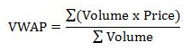

# Coinbase rate VWAP

Application that calculates VWAP in a real-time using Coinbase websocket
steaming protocol of cryptocurrency transactions updates.
Calculated values of VWAP are streamed to os.Stdout for each trading pair.
By default, application subscribes for BTC-USD, ETH-USD and ETH-BTC
trading pairs.

## Synopsis

    $ go run main.go -help
    INFO[0000] Coinbase rate VWAP.
      -capacity int
            Capacity for storing data for VWAP calculation (default 200)
      -channel string
            Channel to subscribe to (default "matches")
      -feed-url string
            Coinbase feed URL (default "wss://ws-feed.exchange.coinbase.com")
      -help
            Show help
      -log-level string
            Logging level (default "error")
      -products string
            Products to subscribe to (default "BTC-USD,ETH-USD,ETH-BTC")

## VWAP

In finance, **volume-weighted average price (VWAP)** is the ratio of the
value of a security or financial asset traded to the total volume of
transactions during a trading session.

In this application the VWAP is calculated per trading pair using
a sliding window of last 200 data points (Could be configured).

## Architecture

Application uses clean architecture. Some of open-source projects was used
to build application. Websocket client is a state machine which subscribes
and unsubscribes from feeds with trading pair transaction updates.
Consumer is subscribed for such updates from Websocket client and supplies
data to use-case which calculates the VWAP of offered trading pair and
stores it in a repository. Storage is like a cyclic buffer and stores last
200 data points.

## Developer instructions

### Building

To build application run:

    make

or

    make BINARY_NAME=vwap build

### Testing

To start unit-tests:

    make test

### Run

To start application with default arguments:

    make run

### Run with verbose logging

To start application with error level set to Debug:

    make debug
